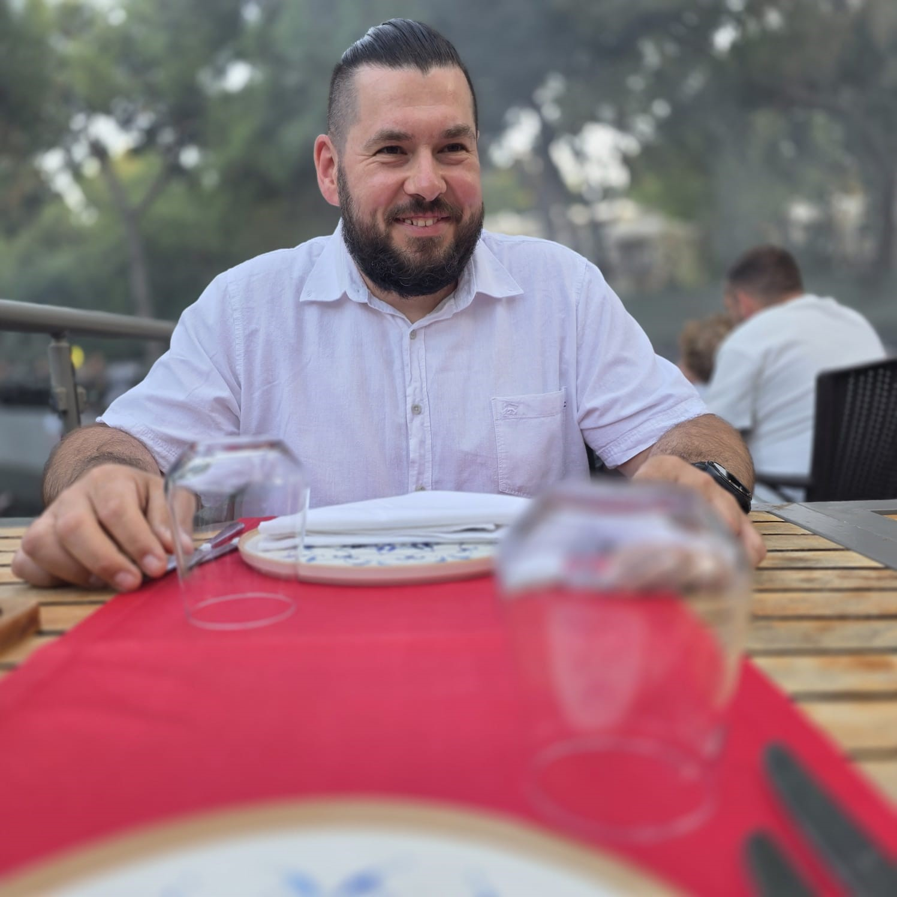

<!DOCTYPE html>
<html lang="pl">
<head>
&#x20;   <meta charset="UTF-8">
&#x20;   <meta name="viewport" content="width=device-width, initial-scale=1.0">

<title>BEZ KADRU | Fotografia</title>

<meta name="description"
      content="BEZ KADRU – fotografia wolności, natury, podróży, światła i chwil poza schematem.">

<link rel="canonical" href="https://cytruszek84.github.io/">

<meta property="og:type" content="website">
<meta property="og:url" content="https://cytruszek84.github.io/">
<meta property="og:title" content="BEZ KADRU | Fotografia">
<meta property="og:description"
      content="Fotografia wolności, natury, podróży, światła i chwil poza schematem.">
<meta name="twitter:card" content="summary_large_image">

<meta name="description"
      content="Bez Kadru Photography – fotografia krajobrazowa, natura, góry, miasta, mgły, światło i wyjątkowe chwile.">

<meta name="theme-color" content="#f7f5f0">

<!-- Google Analytics -->

<!-- Firebase -->

</head>
<body
&#x20;   oncontextmenu="return false;"
&#x20;   ondragstart="return false;"
&#x20;   onselectstart="return false;"
\>
<!-- =========================================================
&#x20;    HEADER
\========================================================= -->
<header>

    <button
        class="brand"
        onclick="showHome()"
        aria-label="Strona główna"
    >
        
            BEZ KADRU
        

        
            Photography
        
    </button>

    <nav class="main-menu">

        <button
            class="nav-btn active"
            id="nav-gallery"
            onclick="showHome()"
        >
            Galeria
        </button>

        <button
            class="nav-btn"
            id="nav-about"
            onclick="showAbout()"
        >
            O mnie
        </button>

    </nav>

    

        <button
            class="lang-btn active"
            data-lang="pl"
            onclick="setLanguage('pl')"
        >
            PL
        </button>

        <button
            class="lang-btn"
            data-lang="en"
            onclick="setLanguage('en')"
        >
            EN
        </button>

        <button
            class="lang-btn"
            data-lang="de"
            onclick="setLanguage('de')"
        >
            DE
        </button>

    

</header>
<!-- =========================================================
&#x20;    HOME
\========================================================= -->
<main id="home-view">

<!-- HERO -->

<section class="hero">

    

        

            Photography
        

        <h1 id="hero-title">
            Świat zapisany 
            w kadrze.
        </h1>

        

            Fotografia to dla mnie sposób zatrzymywania chwil,
            do których można wrócić nawet po wielu latach.
            Światło, natura, przestrzeń i emocje — właśnie tego szukam
            za każdym razem, kiedy biorę aparat do ręki.
        

        

            <button
                class="primary-btn"
                onclick="scrollToGallery()"
                id="hero-gallery-btn"
            >
                Odkryj galerię
            </button>

            <button
                class="secondary-btn"
                onclick="showAbout()"
                id="hero-about-btn"
            >
                Poznaj mnie
            </button>

        

    

    

        

            <!-- GŁÓWNE ZDJĘCIE -->
            

        

        

            <strong id="hero-badge-title">
                Chwile. Światło. Emocje.
            </strong>

            
                Fotografia z pasją
            

        

    

</section>

<!-- GALLERY -->

<section
    class="section"
    id="gallery-section"
>

    

        

            Portfolio
        

        <h2 id="gallery-title">
            Historie zatrzymane w czasie
        </h2>

        

            Wybierz kolekcję i zobacz fotografie.
            Każdy folder to inna historia, inne światło
            i inne miejsce.
        

    

    

</section>

<!-- SOCIAL -->

<section class="social-section">

    

        

            

                <h2 id="social-title">
                    Zobacz więcej moich kadrów
                </h2>

                

                    Obserwuj mnie również w mediach społecznościowych.
                

            

            

                <!-- LINK TIKTOK -->
                <a
                    class="social-link"
                    href="https://www.tiktok.com/@bezkadru"
                    target="_blank"
                    rel="noopener noreferrer"
                >
                    TikTok
                </a>

                <!-- LINK INSTAGRAM -->
                <a
                    class="social-link"
                    href="https://www.instagram.com/bezkadru"
                    target="_blank"
                    rel="noopener noreferrer"
                >
                    Instagram
                </a>

            

        

    

</section>

</main>
<!-- =========================================================
&#x20;    GALLERY VIEW
\========================================================= -->
<section
&#x20;   id="gallery-view"
&#x20;   class="section"
\>

    <button
        class="back-btn"
        onclick="showHome()"
        id="back-btn"
    >
        ← Wróć do kolekcji
    </button>

    <h2
        class="gallery-title"
        id="folder-title-display"
    >
    </h2>

</section>
<!-- =========================================================
&#x20;    ABOUT
\========================================================= -->
<section
&#x20;   id="about-view"
&#x20;   class="section"
\>

    <!-- ZDJĘCIE AUTORA -->

    

        <!--
            ZAPISZ SWOJE ZDJĘCIE JAKO:

            omnie.jpg

            i umieść je obok index.html
        -->

        

        

            Piotr · Bez Kadru
        

    

    <!-- OPIS -->

    

        

            O mnie
        

        <h2 id="about-title">
            Nie tylko robię zdjęcia.
            Zbieram chwile.
        </h2>

        

            

                Mam na imię Piotr, a w świecie fotografii
                możecie znaleźć mnie jako <strong>Bez Kadru</strong>.
            

            

                Aparat towarzyszy mi od lat. Zabieram go ze sobą
                w podróże, na górskie szlaki, do miast, nad jeziora
                i wszędzie tam, gdzie pojawia się światło,
                którego nie można przegapić.
            

            

                Najbardziej interesują mnie momenty, których
                nie da się powtórzyć — pierwszy promień słońca,
                poranna mgła, pusty szlak, światło zachodzącego
                słońca czy zwykła ulica, która przez kilka sekund
                wygląda zupełnie inaczej.
            

            

                Nie zależy mi na tym, żeby zrobić po prostu
                kolejne zdjęcie. Chcę stworzyć kadr, który
                wywoła emocję i sprawi, że zatrzymasz się
                na chwilę.
            

            

                Zapraszam Cię do mojego fotograficznego świata.
                Mam nadzieję, że znajdziesz tutaj coś,
                co zostanie z Tobą na dłużej.
            

        

        

            Piotr
        

    

</section>
<!-- =========================================================
&#x20;    LIGHTBOX
\========================================================= -->

<button
    class="lightbox-close"
    onclick="closeLightbox()"
    aria-label="Zamknij"
>
    ×
</button>

<!-- =========================================================
&#x20;    FOOTER
\========================================================= -->
<footer>

    BEZ KADRU

    Photography · Hobby · Passion

    © Wszystkie fotografie są chronione prawem autorskim.
    Kopiowanie i rozpowszechnianie bez zgody autora jest zabronione.

    
        Odwiedziny
    

    
        …
    

</footer>

</body>
</html>
